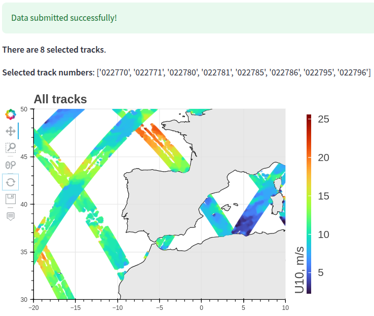

# GPM_DPR_wind_product


## 📖 Description
This project presents an interactive tool for visualizing the wind speed data obtained from the measurements of Dual-frequency Precipitation Radar (DPR) onboard the Global Precipitation Measurement mission (GPM) satellite (see the [JAXA website](https://global.jaxa.jp/projects/sat/gpm/)) according to the method outlined in the [paper](https://doi.org/10.3390/rs13224565).

This data can be useful for scientists interested in investigating wind energy resources, processes in the ocean boundary layer, or validation of wind speed data obtained from other sources.

## 🚀 Deployment

The web app consists of the backend (written using FastAPI) and the frontend (written using Streamlit). If you want to deploy the app, do the following:

1. Install [Docker](https://docs.docker.com/engine/install/), start the service. Install [Docker Compose](https://docs.docker.com/compose/install/)
2. Clone the repo, `cd` to the `GPM_DPR_wind_product` directory
3. Run `docker compose up --build`
4. The web interface will be available at `http://<ip_or_hostname>:8501/`

If you want to use our deployed app, contact Maria Panfilova ([LinkedIn](https://www.linkedin.com/in/%D0%BC%D0%B0%D1%80%D0%B8%D1%8F-%D0%BF%D0%B0%D0%BD%D1%84%D0%B8%D0%BB%D0%BE%D0%B2%D0%B0-093099a2/), [ResearchGate](https://www.researchgate.net/profile/Maria-Panfilova-3)).


## 🌐 Web interface

### Input data

A screenshot:

<div align="left">
  
</div>

<!--    -->

| Field(s)         | Comments |
|------------------------------|-------------|
| `Start date`, <br> `End date`  | The dates must satisfy `0 <= date_end - date_start <= 31 days`. <br> Currently, the wind speed data is available for the dates from `2017-01-01` to `2019-12-21`.|
| `Minimum latitude`, <br> `Maximum latitude`  | The range for each value is `-90.0 <= latitude <= +90.0`. |
| `Minimum longitude`, <br> `Maximum longitude` | The range for each value is `-180.0 <= longitude < +180.0`. |
| `Visualize each track separately` | Whether there should be a separate plot for each found track (if not clicked on, all found tracks will be visualized on the same plot) |
| `Add hover tool` | Whether to show the values of the latitude, longitude and wind speed at the point that the mouse hovers over. Currently, this hover tool is useless for most of the zoom level values (the tool can be turned off, though). It is only usable for a narrow range of the zoom level. |

After filling in the form, press `Submit`. The typical processing time is about `(end_day - start_day + 2) * 30_seconds`, so be patient (see the `Running` indicator at the top of the web page).

### Output

A screenshot:

<div align="left">
  
</div>

<!--    -->

You can use the interactive tools for the plot on the left:
 - `Pan` for moving the region of interest after zooming in,
 - `Box Zoom` for zooming in the selected bounding box,
 - `Wheel Zoom` for zooming in using mouse (the aspect ratio will be preserved),
 - `Reset` the view to the original region,
 - `Save` the plot to a PNG file,
 - (optionally) `Hover` (can be turned off if it is hindering the visualization).

## 📧 Contact
 - Maria Panfilova: [LinkedIn](https://www.linkedin.com/in/%D0%BC%D0%B0%D1%80%D0%B8%D1%8F-%D0%BF%D0%B0%D0%BD%D1%84%D0%B8%D0%BB%D0%BE%D0%B2%D0%B0-093099a2/), [ResearchGate](https://www.researchgate.net/profile/Maria-Panfilova-3)
 - Dmitry Burdeiny: [LinkedIn](https://www.linkedin.com/in/dmitry-burdeiny-84583a245/)

## 📚 References

```BibTeX
@Article{rs13224565,
  AUTHOR         = {Panfilova, Maria and Karaev, Vladimir},
  TITLE          = {Wind Speed Retrieval Algorithm Using Ku-Band Radar Onboard GPM Satellite},
  JOURNAL        = {Remote Sensing},
  VOLUME         = {13},
  YEAR           = {2021},
  NUMBER         = {22},
  ARTICLE-NUMBER = {4565},
  URL            = {https://www.mdpi.com/2072-4292/13/22/4565},
  ISSN           = {2072-4292},
  DOI            = {10.3390/rs13224565}
}

@misc{JAXA_GPM,
  author       = {{Japan Aerospace Exploration Agency (JAXA)}},
  title        = {Global Precipitation Measurement (GPM)},
  year         = {2025},
  url          = {https://global.jaxa.jp/projects/sat/gpm/}
}
```
